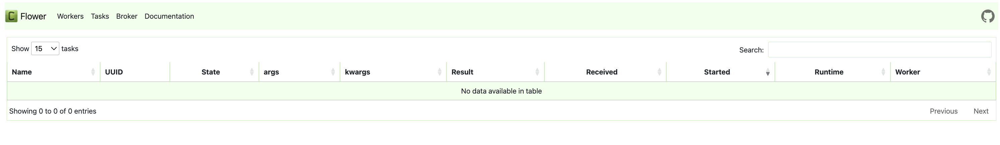
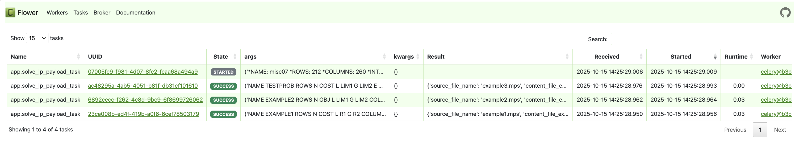

## The article

Medium post with more details, [link-not-ready](here)
# LP Solver API — Flask + Celery + Redis + HiGHS

A lightweight HTTP service that queues **Linear Programming (LP)** jobs and solves them asynchronously with **HiGHS** (`highspy`).

**Stack:** Flask (API) · Celery (workers) · Redis (broker/results) · Flower (monitoring) · Docker Compose (or local)

> Supports **`.mps`** files submitted as JSON string payloads  
> Scales horizontally via more Celery workers

---

## Features

- Async job queue (Celery + Redis)
- HiGHS solver via `highspy` for MPS models
- REST endpoints for task submission & polling
- Flower UI for monitoring
- Sensible Celery defaults (concurrency/prefetch) for predictable throughput

---

## Architecture

```
        +-------------+           Redis (broker + results)
POST -->|  Flask API  |--enqueue-->    redis:6379    <--pull/ack--> Celery worker (HiGHS)
GET  <--|             |<--status--+                                      \
        +-------------+           |                                       \__ Flower UI (5555)
                                  +-- Redis hash "lp_tasks" for submitted task metadata
```

- `POST /solve_lp_payload` → enqueue job with `{content: <MPS string>, metadata: {...}}`
- `GET /check_lp_task/<task_id>` → poll status or get result

---

## Quickstart (Docker)

1. **Environment**

Create a minimal `.env` (used by `config_app.py`):
```dotenv
REDIS_HOST=redis
REDIS_PORT=6379
```

2. **Run**
```bash
docker compose up --build
# (add -d to detach)
```

Services:
- API → http://localhost:5000  
- Flower → http://localhost:5555
  **Flower — Tasks (empty)**  
  
- Redis → `redis:6379` (inside the Compose network)

Stop & clean:
```bash
docker compose down -v
```

---

## Quickstart (Local)

**Prereqs**
- Python 3.10+
- Redis running locally (e.g., `brew install redis && redis-server` on macOS)
- `pip install -r requirements.txt` (includes `highspy`)

**Run**
```bash
# 1) venv + deps
python -m venv .venv
source .venv/bin/activate
pip install -r requirements.txt

# 2) env
export REDIS_HOST=127.0.0.1
export REDIS_PORT=6379

# 3) API
python app.py   # -> http://127.0.0.1:5000

# 4) Worker (new terminal)
celery -A app.xxx worker --loglevel=info -c 2 --prefetch-multiplier=1

# 5) Flower (optional)
flower --broker=redis://$REDIS_HOST:$REDIS_PORT/0 --port=5555
```

---

## API

### `POST /solve_lp_payload`

**Request**
```json
{
  "content": "...MPS FILE AS STRING...",
  "metadata": {
    "source_file_name": "model.mps",
    "content_file_ext": "mps",
    "user_id": "test_user"
  }
}
```

**Responses**
- `202 Accepted`
```json
{
  "task_id": "e1f1d8c6-...",
  "status": "task submitted",
  "metadata": {
    "source_file_name": "model.mps",
    "content_file_ext": "mps",
    "user_id": "test_user",
    "submitted_at": "..."
  }
}
```
- `400 Bad Request` — missing `content` or unsupported extension

### `GET /check_lp_task/<task_id>`

- `200 OK` → ready; returns `result`
- `202 Accepted` → not ready yet
- `404 Not Found` → unknown task id

**Example ready payload**
```json
{
  "result": {
    "task_status": "success",
    "model_status": "Optimal",
    "objective": 123.45,
    "iteration_count": 42,
    "variables": [ ... ],
    "row_values": [ ... ],
    "runtime_sec": 0.321,
    "task_id": "e1f1d8c6-...",
    "source_file_name": "model.mps",
    "content_file_ext": "mps",
    "user_id": "test_user",
    "submitted_at": "..."
  },
  "exists": true,
  "ready": true
}
```

---

## Testing (pytest & manual)

Before testing, open **Flower** to monitor the queue and tasks in real time:
- With Docker Compose: bring up the stack and visit **http://localhost:5555**.

### Option A: Run the ready-made pytest suite
```bash
docker compose up --build -d   # bring up API / worker / Redis / Flower
pytest -vv                     # run end-to-end tests
```
The tests submit sample `.mps` files, poll `/check_lp_task/<id>`, assert objective/model status/variables/iteration counts, and verify `400` for unsupported types.
  **Pytest run**  
  
  
### Option B: Manual checks (no edits needed)

Use the helper scripts included in the repo:

- **Batch submit & (optionally) poll**  
  ```bash
  python tests/submit_jobs.py
  python tests/submit_jobs.py --poll
  ```
- **Flower — Tasks (after submit_jobs.py)**  
  

  
- **Single-file CLI (quick smoke test)** — `tests/submit_one.py`  
  ```bash
  # Submit and poll until ready (prints dots while polling)
  python tests/submit_one.py --file tests/test_problems/example1.mps --poll --timeout 120

  # Submit only (don’t wait)
  python tests/submit_one.py --file tests/test_problems/example2.mps

  # Negative test: force an unsupported extension
  python tests/submit_one.py --file tests/test_problems/example1.mps --ext random
  ```

- **Inspect results from Redis**  
  ```bash
  python tests/check_jobs.py
  ```
  **Jobs Check script**  
  
  
> You can run `submit_jobs.py` multiple times to queue more tasks and observe concurrency in Flower.
> **Flower — Many tasks submitted**  
  
  
---

## Configuration

Environment (via `config_app.py`):

| Variable     | Default (Docker) | Description          |
|--------------|------------------|----------------------|
| `REDIS_HOST` | `redis`          | Redis hostname       |
| `REDIS_PORT` | `6379`           | Redis port           |

Derived:
- `CELERY_BROKER_URL = redis://{REDIS_HOST}:{REDIS_PORT}/0`
- `CELERY_RESULT_BACKEND = redis://{REDIS_HOST}:{REDIS_PORT}/0`
- `SUPPORTED_FILE_EXTENSIONS = {"mps"}`
- `REDIS_LP_TASKS_KEY = "lp_tasks"`

**Celery knobs** (in `app.xxx.conf.update(...)`):
```python
result_persistent=True
result_expires=3600
worker_concurrency=2
worker_prefetch_multiplier=1
# Optional reliability:
# task_soft_time_limit=1500
# task_time_limit=1800
# task_track_started=True
```


---
## Medium Article

**Evolving a Flask + Celery Example into an API for Linear Programming Problems**

This article walks through how a simple Flask+Celery demo became a lightweight **LP Solver API**:
- **Motivation:** shared solver bottlenecks (delays, blocking, no ETA).
- **Stack:** Flask API + Celery workers + Redis + Flower; HiGHS (`highspy`) as the first solver.
- **API design:** POST MPS models → async Celery task → poll `/check_lp_task/<id>` for results.
- **Extensibility:** a dispatcher pattern to support more formats/solvers (e.g., Gurobi, `.lp`, JSON).
- **Operations:** predictable performance with `worker_concurrency` and **fairness** via `worker_prefetch_multiplier=1`, plus time limits and task tracking.
- **Observability:** using Flower for real-time visibility, with OpenTelemetry noted as a next step.
- **Testing:** ready-made `pytest` end2end tests, plus simple CLI helpers (`tests/submit_jobs.py`, `tests/check_jobs.py`).

> Read the post for the narrative, trade-offs, and future directions (OpenTelemetry, Redis vs RabbitMQ, and splitting heavy/light workers).

---

## Troubleshooting

- **Unsupported file type** → only `mps` allowed by default (`SUPPORTED_FILE_EXTENSIONS`)
- **Large payloads** → consider object storage + signed URLs (future enhancement), or enforce payload limits at the proxy
- **Stuck tasks** → enable `task_track_started`, review worker logs, consider `task_time_limit` and `visibility_timeout`
- **Throughput vs fairness**:
  - CPU/long tasks → `--prefetch-multiplier=1`
  - Short/IO tasks → increase prefetch (e.g., 4–10) for higher throughput
